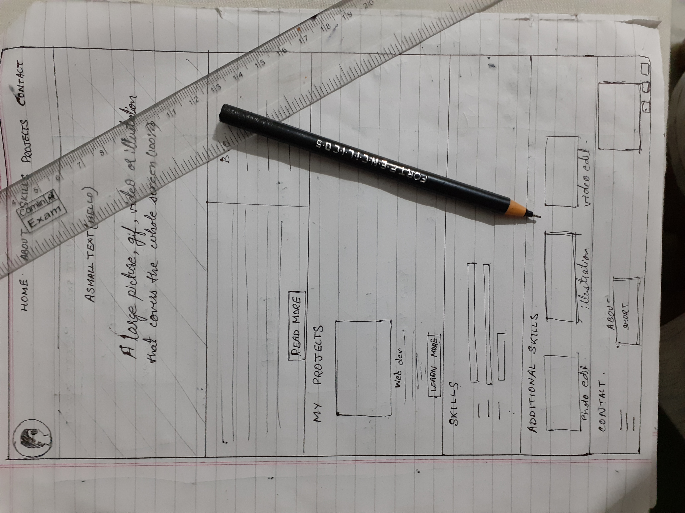

# IEEE LEAD

**NAME :** ANUBHAV SINHA

**GROUP NO.** 8

**MILESTONES ACHIEVED**
* [x] ABOUT PAGE
* [x] PROJECT PAGE
* [x] SKILLS PAGE
* [x] OPTIONAL MILESTONE 
    * CONTACT PAGE
    * TECHNICAL-DESIGN SKILLS PAGE
    * Loading Animation
    * Responsive

**TECH STACK**
* HTML
* CSS
* JavaScript

**DESCRIPTION (About Project)**

My project has a landing page which has loading animations. As the logo and the header appear we can move across various pages(sections).

The about section has a brief description about me. It has a readmore button which directs you to a separate page which has additonal data.

The project section has my projects palced as flex-box cards, with an image/gif and short description about the porjects.

The skills page is the most silent and simple feature which has a list of my technical skills.

Below the skills page there is an additional skills page which has my technical designs showcased in flex-box cards. There are links that direct towards my 
showcased finished work in each skill- one being my YouTube channel and others being separate pages.

The Last is contact page with all my profiles linked and a photo of me.

The header always stays on the top which has the navbar and the logo. The logo is also a link that directs to the landing page.

The separated pages also have some loading animations.

**UNIQUE**

This project is totally designed by me from scratch. Each and every feature of the project is written by me from the root level - no third party help (No bootstrap, no downloaded animation style sheet, no external javascript, nothing. All are my codes).

The second thing that I'm proud about in this project is the readability of the code. It is very neat and organised. Addition and deletion of any new feature is very easy.

**PROBLEMS FACED**

The problem that I faced was was that I wanted it to be reponsive but it was difficult for me to make it just how I expected to be on the mobile. However I managed to do it in the end with alot of redos in many sections.

**SCOPE OF IMPROVEMENT**

Adding animation on scroll would make the project much more elegant.

**WHAT YOU LEARNED?**

Other than HTML, CSS and Javascript, I learned that just jumping to the work doesn't help. You must plan it first. You must have a clear idea about how you want your project to look like when done. Accordingly plan the execution. I also learnt that organised work is easy to edit and develop. I got this project when I was bombarded with college assignments all at once. Still I could achieve the milestone. So, i definitely learnt time management from this project.
