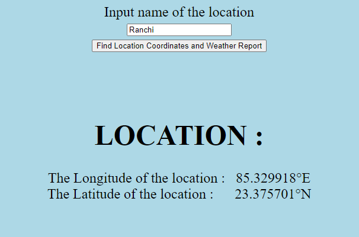
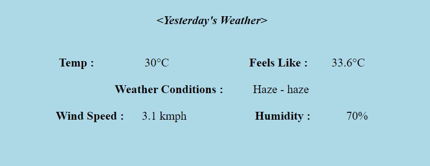
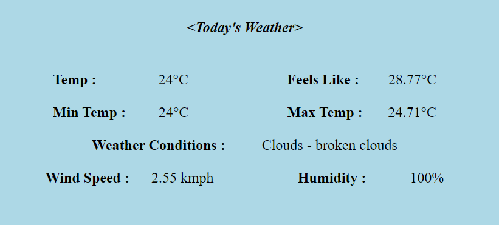
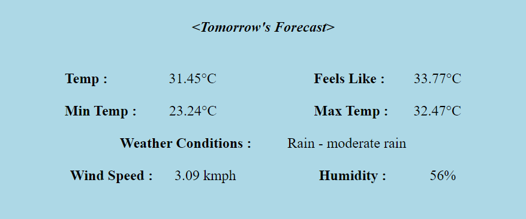

# Weather App

**NAME** - Anshul Pandey

**GROUP NO.** - 8

**MILESTONES ACHIEVED** - 

    1. Longitude, Latitude of the Location
    2. Current Weather/Today's Weather
    3. Previous two day's weather & Forecast of tomorrow and day after tomorrow's weather
    4. Optional Milestones :- Background changes as per the weather conditions
          
          
**TECH STACK**

    1. HTML
    2. CSS
    3. JAVASCRIPT
    4. APIS

**DESCRIPTION**

The project consists of a simple textbox which takes the input location in text and outputs its coordinates and its weather report of 5 days - day before yesterday, yesterday, today, tomorrow, day after tomorrow.

**UNIQUE**

It is simple but it contains all the information that you need. It provides you with max and min temperature of the day, weather conditions, wind speed(which could be used to predict the danger weather- toofaans), humidity and current feeling temperature. 

**PROBLEMS FACED**

Initially problems were faced in getting the previous days weather but one call's api of openweathermap helped to solve it efficiently. 

**SCOPE OF IMPROVEMENT**

The page is not pretty and interactive.

**WHAT YOU LEARNED**

I learned how to make API calls, use the language - Javascript and use the basics of HTML and CSS.

**LINK FOR THIS PROJECT -** https://anshul275.github.io/Weather-App/

**SCREENSHOTS** 

