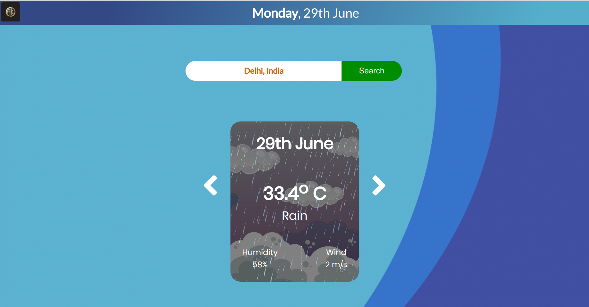

**LINK FOR THIS PROJECT -** https://blastoise.github.io/Weather-App/

# Weather App

**NAME** - Ashutosh Kumar

**GROUP NO.** - 4

**MILESTONES ACHIEVED** - 

    1. Longitude, Latitude of the Location
    2. Current Weather/Today's Weather
    3. Weather of 5 previous days and forecast of 7 days.
    4. OPTIONAL MILESTONES -
          a. Loader is added while data is loading 
          b. Cards for displaying the weather
          c. Different background for different weather

          
          
**TECH STACK**

    1. HTML
    2. CSS
    3. JAVASCRIPT

**DESCRIPTION**

The project consists of a simple textbox which takes the input location in text and outputs its weather report for 5 previous days and 7 forecasted weather.

**UNIQUE**

It is simple card slider layout with a loader and cards have a property of showing different background for different weather condition.It shows date of the place searched,temperature,humidity and wind speed.

**PROBLEMS FACED**

Adjusting date of different places because of time zones. 

**SCOPE OF IMPROVEMENT**

Ajusting the layout of the page and making time zones of all country available.

**WHAT YOU LEARNED**

I learned how to make API calls, using the language - Javascript and using the basics of HTML and CSS.

**WEBSITE PREVIEW:**

