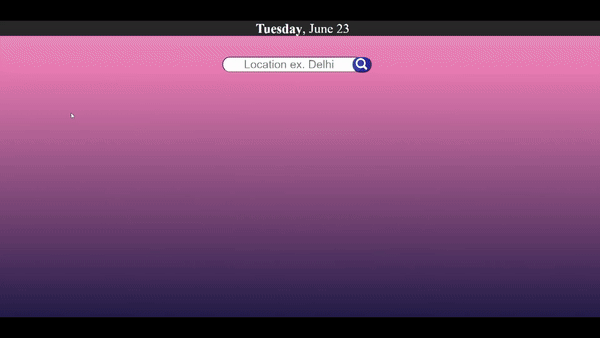

# IEEE LEAD

**WEBSITE LINK :** [Link](https://sinha-anubhav79.github.io/weatherAPI/)

**NAME :** ANUBHAV SINHA

**GROUP NO.** 8

**MILESTONES ACHIEVED**
* [x] Fetching latitude and longitude of a given location through API call
* [x] Fetching weather of given location through API call
* [x] Fetching location’s weather for a past date and displaying weather of current location on website opening
* [x] Additionals: 
    * Background image as per description
    * 5 past date and 7 forecast weather
    * Loading Animation
    * Responsive

**TECH STACK**
* JavaScript
* HTML
* CSS

**DESCRIPTION (About Project)**
This program on starting shows the weather data for current location. There is a search bar on top to search for different locations. The weather data is displayed for past 5 dates and forecast of further 7 days. To navigate between these different dates there are buttons on left and right of the box where the weather data is displayed. In the box, the date is displayed on top then the temperature and then description. Below that humidity and wind speed are also mentioned. The latitude and longitude of the location is also displayed at the bottom of the box. The current date is displayed on top in the header.

**UNIQUE**

I have used two buttons to navigate between the weather data of different dates. Which I don't think anyone has done.

**PROBLEMS FACED**

The only problem I faced this time was fetching weather data for other than current date. Which I later figured out was from a different URL. Other than that it was smooth mostly because of dividing the program in suitable functions.

**SCOPE OF IMPROVEMENT**

Search suggestion could be added for accurate search and to avoid error by non existing user input.

**WHAT YOU LEARNED?**

I learnt practical use of APIs and implementing them was fun. This time I divided my code into different functions which made all the changes to be easily implemented. Neatly organising the code and commenting also helped make this project smooth and easy. Following such coding practices increased my efficiency
